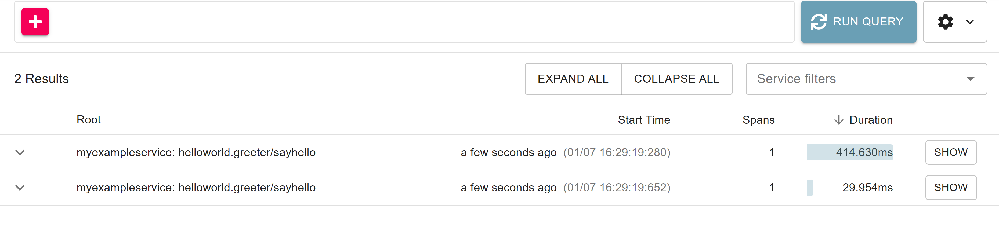
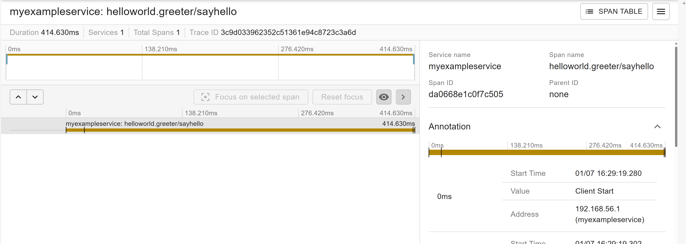
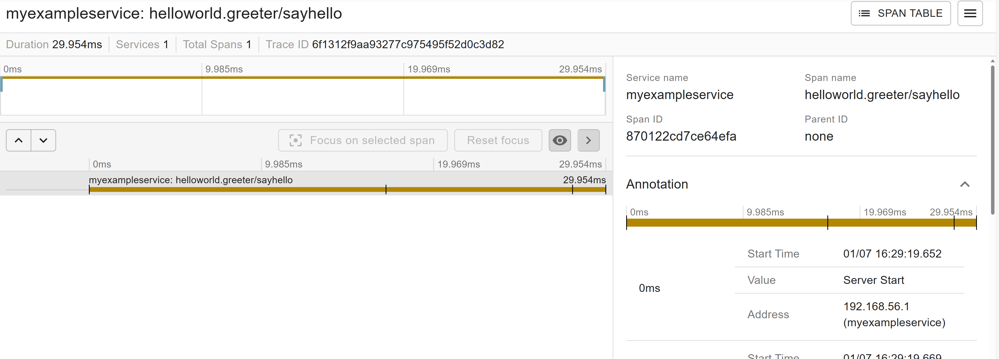

# gRPC Example

**Note:** This is an advanced scenario useful for people who want to *manually* instrument their own code.
(If you're using the [Java agent](https://github.com/open-telemetry/opentelemetry-java-instrumentation), you get this instrumentation "out-of-the-box" and this isn't necessary.)

This is a simple example that demonstrates how to use the OpenTelemetry SDK
to *manually* instrument a simple gRPC-based client/server application.
This example utilizes the [opentelemetry-grpc-1.6](https://github.com/open-telemetry/opentelemetry-java-instrumentation/blob/main/instrumentation/grpc-1.6/library/README.md#library-instrumentation-for-grpc-160)
library to instrument both the gRPC client and server.

## How to Run

### Prerequisites

* Java 17 or higher is required to run Gradle and build this example
* Java 8 or higher may be used to run the example once it has been built

Be in the gRPC project root folder:

```shell script
cd grpc/
```

## 1 - Compile

```shell script
../gradlew shadowJar
```

## 2 - Start the Server

```shell script
java -cp ./build/libs/opentelemetry-examples-grpc-0.1.0-SNAPSHOT-all.jar io.opentelemetry.examples.grpc.HelloWorldServer
```

## 3 - Start the Client

```shell script
java -cp ./build/libs/opentelemetry-examples-grpc-0.1.0-SNAPSHOT-all.jar io.opentelemetry.examples.grpc.HelloWorldClient
```

## Result




