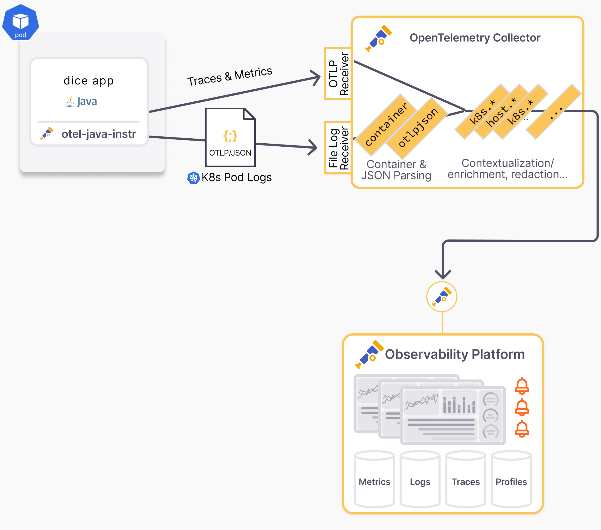
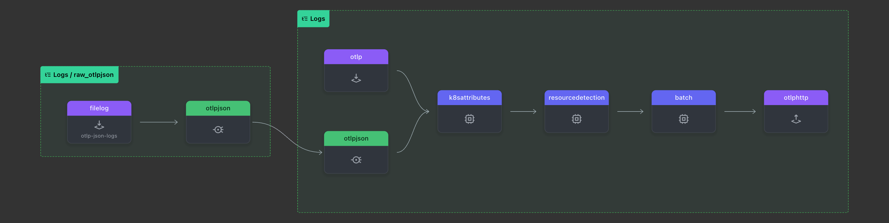

# Exporting Application logs using JSON logging in Kubernetes

If you want to get logs from your Java application ingested into an
OpenTelemetry-compatible logs backend, the easiest and recommended way is using
an OpenTelemetry protocol (OTLP) exporter,
which is explained in the [logging](../logging) example.

However, some scenarios require logs
to be output to files or stdout due to organizational or reliability needs.
Refer to [Collecting OpenTelemetry-compliant Java logs from files](https://opentelemetry.io/blog/2024/collecting-otel-compliant-java-logs-from-files/) for more details.

This example contains

- a Java application that uses the experimental
  [experimental-otlp/stdout](https://github.com/open-telemetry/opentelemetry-specification/blob/main/specification/configuration/sdk-environment-variables.md#in-development-exporter-selection) logs exporter
- an OpenTelemetry collector configuration that uses the
  [OTLP/JSON connector](https://github.com/open-telemetry/opentelemetry-collector-contrib/tree/main/connector/otlpjsonconnector) to turn Pod logs into `OTLP`

## Architecture

The OpenTelemetry Collector pipeline:

## Getting Started

The k8s directory contains the Kubernetes manifests to deploy the application and the collector.

Ignore the `lgtm.yaml` file, which is only used for running locally with
[LGTM](https://github.com/grafana/docker-otel-lgtm/)
and automated testing using [OATs](https://github.com/grafana/oats).

## Running locally

You can run the application locally using the following steps:

1. Run [k3d.sh](./k3d.sh) to start a local Kubernetes cluster with all the necessary components.
2. Generate traffic using [generate-traffic.sh](./generate-traffic.sh)
3. Log in to [http://localhost:3000](http://localhost:3000)
4. Go to "Explore"
5. Select "Loki" as data source to view the logs
